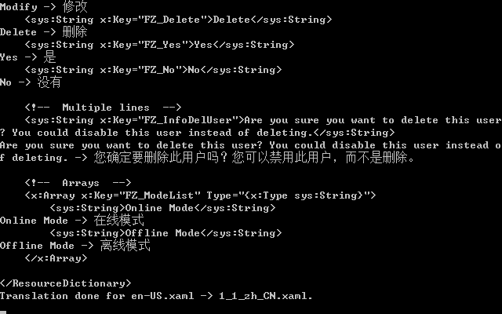

## WPF XAML Translator
A C# application to translate WPF localization files in XAML format from one language to another automatically.

### Usage
```
Translater.exe -inputFile -outputFile -srcLang -dstLang
```

For example: ```Translate.exe en-US.xaml zh-CN.xaml en zh_CN```

### Sample Results

#### Sample Input

```
<ResourceDictionary
    xmlns="http://schemas.microsoft.com/winfx/2006/xaml/presentation"
    xmlns:x="http://schemas.microsoft.com/winfx/2006/xaml"
    xmlns:sys="clr-namespace:System;assembly=mscorlib">

    <!--  Single Line  -->
    <sys:String x:Key="FZ_OK">OK</sys:String>
    <sys:String x:Key="FZ_Cancel">Cancel</sys:String>
    <sys:String x:Key="FZ_Add">Add</sys:String>
    <sys:String x:Key="FZ_Modify">Modify</sys:String>
    <sys:String x:Key="FZ_Delete">Delete</sys:String>
    <sys:String x:Key="FZ_Yes">Yes</sys:String>
    <sys:String x:Key="FZ_No">No</sys:String>

    <!--  Multiple lines  -->
    <sys:String x:Key="FZ_InfoDelUser">Are you sure you want to delete this user? You could disable this user instead of deleting.</sys:String>

    <!--  Arrays  -->
    <x:Array x:Key="FZ_ModeList" Type="{x:Type sys:String}">
        <sys:String>Online Mode</sys:String>
        <sys:String>Offline Mode</sys:String>
    </x:Array>

</ResourceDictionary>
```

#### Sample Output

```
<ResourceDictionary
    xmlns="http://schemas.microsoft.com/winfx/2006/xaml/presentation"
    xmlns:x="http://schemas.microsoft.com/winfx/2006/xaml"
    xmlns:sys="clr-namespace:System;assembly=mscorlib">

    <!--  Single Line  -->
    <sys:String x:Key="FZ_OK">好</sys:String>
    <sys:String x:Key="FZ_Cancel">取消</sys:String>
    <sys:String x:Key="FZ_Add">加</sys:String>
    <sys:String x:Key="FZ_Modify">修改</sys:String>
    <sys:String x:Key="FZ_Delete">删除</sys:String>
    <sys:String x:Key="FZ_Yes">是</sys:String>
    <sys:String x:Key="FZ_No">没有</sys:String>

    <!--  Multiple lines  -->
    <sys:String x:Key="FZ_InfoDelUser">您确定要删除此用户吗？您可以禁用此用户，而不是删除。</sys:String>

    <!--  Arrays  -->
    <x:Array x:Key="FZ_ModeList" Type="{x:Type sys:String}">
        <sys:String>在线模式</sys:String>
        <sys:String>离线模式</sys:String>
    </x:Array>

</ResourceDictionary>
```

### Snapshot



### Author

- [@lanceliao](https://github.com/lanceliao)
- [http://www.shuyz.com](http://www.shuyz.com)

### License
Licensed under the MIT license.